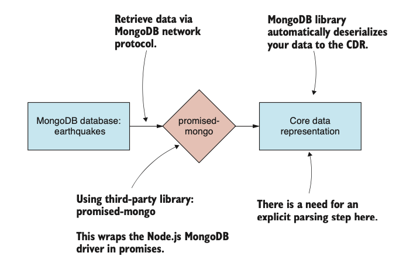

# DATA WRANGLING USING JAVASCRIPT

## C1 - Getting started: establishing your data pipeline


(3) Data wrangling involves wrestling with many different issues. How can you filter or optimize data, so you can work with it more effectively? How can you improve your code to process the data more quickly? How do you work with your language to be more effective? How can you scale up and deal with larger data sets?

(8) Mocha with Chai for JavaScript unit and integration testing.
Collection of Data: Linq (from C#)
Working with time: Moment.JS

(10) The biggest problem I see in many programmers is their failure to think and plan out their work before coding.
(11) If you don’t have enough information to plan, then move forward with exploratory coding and return to planning when you have a better understanding of the problem you’re trying to solve.
Requirements usually change over time as you develop your understanding of the proj- ect. Don’t be concerned if this happens.
>
>
>

(15) Exploratory coding is the process of incrementally building your code through an iterative and interactive process (figure 1.10). Code a few lines, then run the code and inspect the output, repeat. Repeating this process builds up your code and understand- ing at the same time.

## C2 - Working with Node JS

### 1. Working with Node

(35) You might wonder why you need to install dependencies for such a simple code example. Well, truth be told—you don’t! I want you to get in the habit of doing this because most examples do have dependencies and you do need to run npm install to download the dependencies before you run the code.

>**Use Strict**
This statement was introduced in ECMAScript 5 and allows you to opt in to a more restricted and safer version of the language.

```js
npm install --save moment
```

Note the --save parameter saves the dependency in package.json and tracks the ver- sion number

**_Creating a command line app_**
(37) Uses yargs for access to command-line arguments
Uses chai for its assert library for validation

```js
"use strict";

const yargs = require('yargs');
const argv = yargs.argv;
const assert = require('chai').assert;
```

**_Creating a code library_**
(38) Exports the function so that it can be reused in other code module. The code module can now be imported into your command-line app (or indeed any other code module) using Node’s _require_ function

```js
"use strict";
function generateReport (data) {
    const columns = Object.keys(data[0]); 
    return {
        numRows: data.length, numColumns: columns.length, columnNames: columns,
    };
};
module.exports = generateReport;
```

---
In other code module:

```js
...
const generateReport = require(‘./generate-report.js’);
const report = generateReport(data);
...
```

---

We can also export an object, and this allows us to export a library of functions.

```js
module.exports = {
    someFunction1: function (param1, param2, etc) {
    //
    // Code //
    // Return result
    },
    someFunction2: function (param1, param2, etc) { //
    // Code //
    // Return result
    },
    ...
};
```

### 2. Creating a simple web server

Using Express:

```bash
npm install -–save express
```

### 3. Adding a REST API

(43) Define a handler for the route /rest/data

```js
app.get("/rest/data", (req, res) => { const report = generateReport(data); res.json(report);
});
```

(44) Then we can use jQuery or 

```js
<script>
$.getJSON("/rest/data", function (report) { 
    document.write(
        "Num rows: " + report.numRows + "\r\n" +
        "Num columns: " + report.numColumns + "\r\n" + "Columns: " + report.columns.join(', ')
    );
});
</script>
```

$.getJSON() ~ $.ajax({})

(47) In other languages and environments where synchronous coding is normal, we can avoid this problem by delegating such resource-intensive operations to a worker thread. Generally, though, we can’t use threads like this in Node.js, which is typically consid- ered to be single-threaded.

A callback is a JavaScript function that’s automatically called for you when a single asynchronous operation has completed.


(52) Asynchronous coding with promises (Promise design pattern) dealing with the following problems of callbacks:

- Callback Hell
- Callback Order
- Error Handling

>**A promise** is an object that wraps an asynchronous operation and promises to deliver an outcome (or an error) at some time in the future.
Promises give us a vocabulary to express chains of asynchronous operations in a way that almost looks (if you squint your eyes) like it was a sequence of synchronous operations.

_**THEN**_

Then is used to chain together a sequence of asynchronous operations

>

_**ALL**_

Promise.all is used to manage asynchronous operations that are running in paral- lel. It automatically weaves together the callbacks and invokes a single final callback (figure 2.22). Using all, you no longer need to worry about coordinating multiple callbacks that might be invoked in any order.

_**CATCH**_

Using promises, we can attach an error handler to the end of our chain


>Always have at least 1 error handler

### 4. Wrapping async ops in promises

(55) We instantiate a Promise object with an anonymous function that initiates the asyn- chronous file loading operation. The anonymous function is passed two parameters. The first parameter is a resolve function that we call when the asynchronous operation has completed and we’re ready to resolve the promise. This will trigger the next then handler that is chained to the promise. The second parameter is a reject function that we can call if an error occurs. We can use this to fail the promise and trigger the closest catch handler in the promise chain:


### 5. Async code with async and await

## C3 - Acquisition, storage and retrieval

### 1. Core Data Representation (CDR)

(61) This is a design pattern for structuring data pipelines. The CDR allows us to piece together flexible data pipe- lines from reusable code modules.


(62) You might say the CDR is the glue that binds together our data pipeline. its purpose is to allow our pipeline stages to communicate and be cleanly separated with no hard dependencies on each other. ***This separation is what allows us to build reusable code modules that we can then rearrange to create other data pipelines.***


### 2. Importing data

```js
const fs = require('fs');
// Read a text file form the file system.
function read (fileName) {
    return new Promise((resolve, reject) => {
        fs.readFile(fileName, "utf8",
            (err, textFileData) => {
                if (err) {
                    reject(err);
                    return;
                }
                resolve(textFileData);
            }
        );
    });
};
```

(69) What happens when we load a large text file that doesn’t fit in memory?
When this happens, Node.js raises an out-of-memory error.

Using request-promise library for getting data from REST API

```bash
npm install –-save request-promise request
```


(71) Parse JSON using Javascript JSON API

```js
const file = require('./file.js');
// Helper function to import a JSON file.
function importJsonFile (filePath) {
 return file.read(filePath)
  .then(textFileData => {
   return JSON.parse(textFileData);
  });
};
module.exports = importJsonFile;
```

(72) Passing data from a REST API

```js
const importJsonFromRestApi = require('./toolkit/importJsonFromRestApi.js'); // Require our "importJsonFromRestApi" toolkit function.

const url = "https://earthquake.usgs.gov/earthquakes/feed/v1.0/summary/significant_month.geojson";

importJsonFromRestApi(url) // Use our toolkit function to import data from the REST API.
.then(data => { // Callback to handle imported data.
    const earthquakes = data.features.map(feature => { // Restructure incoming data to the CDR.
        const earthquake = Object.assign({}, feature.properties, { id: feature.id }); 
        return earthquake;
    });
    console.log(earthquakes); // Print the data to the console so that we can verify it.
 })
.catch(err => { // Handle any error that might have occurred.
    console.error("An error occurred.");
    console.error(err.stack);
});
```

(74) Parsing CSV text data - using papa parse
As with JSON, we start by reading the CSV text file into memory; after that, we use Papa Parse to decode the text data to the CDR.


(76) Parsing CSV data from REST API

(78) Importing data from database
(79) MongoDB doesn’t impose a fixed schema on your data, so we don’t need to predefine the structure of the database.

```bash
npm install –-save promised-mongo
```



```js
const mongo = require('promised-mongo');
const importFromMongoDB = require('./toolkit/importFromMongoDB.js');

const db = mongo("localhost:6000/earthquakes", ["largest_earthquakes"]);

importFromMongoDB(db, "largest_earthquakes")
    .then(data => {
        console.log(data);
    })
    .then(() => db.close())
    .catch(err => {
        console.error(err);
    });
```

(82) Importing data from MySQL

### 3. Exporting Data

**General Pattern for Data Export:**

```js
const importCsvFile = require('./importCsvFile');
importCsvFile("./data/earthquakes.csv")
.then(earthquakesData => {
    //
    // ... Export code here ... //
})
.catch(err => {
    console.error("An error occurred.");
    console.error(err.stack);
});
```

(85) Exporting to a text file starts with serialization of the data that we’re holding in the core data representation.


```js
function write (fileName, textFileData) {
    return new Promise((resolve, reject) => {
        fs.writeFile(fileName, textFileData, (err) => {
            if (err) {
                reject(err);
                return;
            }
            resolve();
        });
    });
};
```

(89) Export data to CSV text files
>Uses papa.unparse to convert from CDR to CSV text data.
Uses our file.write toolkit function to write the CSV data to the filesystem.


```js
const papa = require('papaparse');
const file = require('./file.js');

function exportCsvFile (fileName, data) {
    const csv = papa.unparse(data);
    return file.write(fileName, csv);
};
module.exports = exportCsvFile;
```

(91) Export data to Database

```js
function exportToMongoDB (db, collectionName, data) {
    return db[collectionName].insert(data);
};
module.exports = exportToMongoDB;

...

const db = mongo("localhost:6000/earthquakes", ["largest_earthquakes_export"]
);

importCsvFile("./data/earthquakes.csv")
.then(data =>
    exportToMongoDB(db, "largest_earthquakes_export", data)
    .then(() => db.close())
    .catch(err => {
        console.error("An error occurred.");
        console.error(err.stack);
    });

```

### 4. Building complete data conversion

### 5. Expanding the concept


## C4 - WORKING WITH UNUSUAL DATA


### 1. Import custom data

Our first port of call when working with regular expressions should be to an online testing tool such as <https://regex101.com>.

(103) You should recognize regular expressions as a powerful technique for parsing unusual data formats.

### 2. Import data by web scrape

(104) Your web scraping script depends on the structure of the page being scraped: if that structure changes, then your script will be broken. This makes web scraping scripts inherently fragile. For these reasons web scraping as a data source should be considered a last resort.


***Scraping with cheerio***

```js
function scrapeWebPage (url) {
    return request.get(url)
        .then(response => {
            const $ = cheerio.load(response);
            const headers = $("thead tr")
                .map((i, el) => {
                    return $(el)
                        .find("th")
                        .map((i, el) => {
                            return $(el).text();
                        })
                        .toArray();
                })
                .toArray();

            const rows = $("tbody tr")
                .map((i, el) => {
                    return [$(el)
                        .find("td")
                        .map((i, el) => {
                            return $(el).text();
                        })
                        .toArray()];
                })
                .toArray();

            return rows.map(row => {
                    const record = {};
                    headers.forEach((fieldName, columnIndex) => {
                        if (fieldName.trim().length > 0) {
                            record[fieldName] = row[columnIndex];
                        }
                    });
                    return record;
                });
        });
};
```

(107) If you have a more complex scraping job to do, for example, one that requires authenti- cation, browser interaction, or even waiting for the browser’s JavaScript to evaluate, then this simple approach won’t be enough for you. You’ll need to simulate the web page fully using a headless browser —that’s a web browser that has no visible UI and is driven only by code.

### 4. Working with binary data

#### 4.1. Read from JS Buffer

(107) The built-in JSON serializer is already well optimized and extremely fast. You’ll have to be smart and work pretty hard to beat it!


```js
const buffer = fs.readFileSync("./data/earthquakes.bin");
const numRecords = buffer.readInt32LE(0);
let bufferOffset = 4;
const records = [];

for (let recordIndex = 0; recordIndex < numRecords; ++recordIndex) {
    const time = buffer.readDoubleLE(bufferOffset);
    const record = {
        Time: new Date(time),
        Latitude: buffer.readDoubleLE(bufferOffset + 8),
        Longitude: buffer.readDoubleLE(bufferOffset + 16),
        Depth_Km: buffer.readDoubleLE(bufferOffset + 24),
        Magnitude: buffer.readDoubleLE(bufferOffset + 32),
    };
    bufferOffset += 8 * 5;
    records.push(record);
}
```

(110) Does this work for large files?
The short answer is no. This technique is simple, but unfortunately it doesn’t scale to large files. Loading a large file in this way will cause an out-of-memory error.
>To work with large files, you’ll need to use Node.js streams (which you’ll look at in chapter 7) that allow you to iteratively process a large file in chunks.

#### 4.2. Packing to binary data file

(111) We start by creating a Node.js Buffer object (1). Before writing records to the buffer, we must first record the number of records (2), because this allows us to know how many records to expect when we later decode the binary file. Then we pack each earthquake record sequentially into the buffer (3). Finally, the buffer is written out to our binary file earthquakes.bin (4).

***Illustrate packing 1 record to buffer***

>

***Illustrate Write buffer record to data file***

>

```js
const fs = require('fs');
const moment = require('moment');

const records = JSON.parse(fs.readFileSync("./data/earthquakes.json", "utf8"));

const bufferSize = 4 + 8 * 5 * records.length;
const buffer = new Buffer(bufferSize);

buffer.writeInt32LE(records.length);

let bufferOffset = 4;

for (let recordIndex = 0; recordIndex < records.length; ++recordIndex) {

    const record = records[recordIndex];
    const time = moment(record.Time).toDate().getTime();
    buffer.writeDoubleLE(time, bufferOffset);
    bufferOffset += 8;

    buffer.writeDoubleLE(record.Latitude, bufferOffset);
    bufferOffset += 8;

    buffer.writeDoubleLE(record.Longitude, bufferOffset);
    bufferOffset += 8;

    buffer.writeDoubleLE(record.Depth_Km, bufferOffset);
    bufferOffset += 8;

    buffer.writeDoubleLE(record.Magnitude, bufferOffset);
    bufferOffset += 8;
}

fs.writeFileSync("./output/earthquakes.bin", buffer);
```

#### 4.3. Replacing JSON with BSON

(113) BSON is a standard and mature data format. It’s the format that underlies Mon- goDB.

***Convert JSON to BSON format***

```js
const fs = require('fs');
const moment = require('moment');
const BSON = require('bson');

const records = JSON.parse(fs.readFileSync("./data/earthquakes.json", "utf8"));

for (let recordIndex = 0; recordIndex < records.length; ++recordIndex) {
    const record = records[recordIndex];
    record.Time = moment(record.Time).toDate();
}

const bson = new BSON();
const serializedData = bson.serialize(records);

fs.writeFileSync("./output/earthquakes.bson", serializedData);
```

***Deserialize a BSON file***

```js
const fs = require('fs');
const BSON = require('bson');

const loadedData = fs.readFileSync("./data/earthquakes.bson");

const bson = new BSON();
const deserializedData = bson.deserialize(loadedData);

console.log(deserializedData);
```

## C5 - Eploratory Coding

### 1. Expanding your toolkit

(116) Having quick iterations and reducing the trip around the feedback loop are vital for your productivity.


### 2. Working with reduce data sample

(120) When we’re sure that our code is robust and reliable, we can scale up to the full data set.

### 3. Prototype with Excel

() We’re only using Excel for quick prototyping before we move to Node.js, which can save time initially.
We’ll create a new Trend column in our data set. Using Excel’s FORECAST function, we’ll forecast fatalities based on six months of data.


### 4. Explore data using NOdeJS

#### 4.1. Using nodemon

(123) Install nodemon globally (live-server and nodemon to be global packages)

```bash
npm install -g nodemon
```

We then using the nodemon instead of regular node listing-5.1.js like this:

```bash
nodemon listing-5.1.js
```

(128) When we read the CSV file using Data-Forge, it gives us a DataFrame object that con- tains the data set.
(129) One useful thing that Data-Forge does is summarize the types that are in our data set. The output in figure 5.14 is produced by the Data-Forge function detectTypes, which scans the data set and produces a new table that shows the frequency of different types in our data.

Instruct DataForge for each col datatype:

```js
const dataForge = require('data-forge');

dataForge.readFile("./data/monthly_crashes-cut-down.csv")
    .parseCSV()
    .then(dataFrame => {
        dataFrame = dataFrame.parseFloats([
            "Month#", 
            "Year", 
            "Crashes", 
            "Fatalities", 
            "Hospitalized"
        ]);
        console.log(dataFrame.detectTypes().toString());
    })
    .catch(err => {
        console.error(err && err.stack || err);
    });
```

#### 4.2. Compute the trend column

(130) The general workaround is: Extract the Fatalities col and calculate the trend then write back to the file with new column (Trend).

- First we get the Fatalities for data inspection:

```js
...
dataFrame
.getSeries("Fatalities") .head(3)
.toString()
...
```

- Secondly, using FormulaJS which is the implementation of most Excel formula. Using FORECAST func on the extracted Months and Fatalities cols.

```js
dataForge.readFile("./data/monthly_crashes-cut-down.csv")
    .parseCSV()
    .then(dataFrame => {
        dataFrame = dataFrame.parseFloats([
            "Month#", "Year", "Crashes", "Fatalities", 
            "Hospitalized"
        ]);
        const monthNoSeries = dataFrame.getSeries("Month#");
        const xValues = monthNoSeries.head(6).toArray();
        const fatalitiesSeries = dataFrame.getSeries("Fatalities");
        const yValues = fatalitiesSeries.head(6).toArray();
        const nextMonthNo = monthNoSeries.skip(6).first();
        const nextMonthFatalitiesForecast = formulajs.FORECAST(nextMonthNo, yValues, xValues);
        console.log('Forecasted fatalities: ' + nextMonthFatalitiesForecast);
    })
    .catch(err => {
        console.error(err && err.stack || err);
    });
```

- Thirdly, using the built in rollingWindow function of DataForge Library to calc the trend every 6 (mont, fatal).

(133) Note in listing 5.11 how we use setIndex to set the Month# column as the index for the DataFrame. Having an index on the DataFrame allows the new Trend column to be integrated into it using the withSeries function that you can see toward the end of the code listing.

```js
dataForge.readFile("./data/monthly_crashes-cut-down.csv")
    .parseCSV()
    .then(dataFrame => {
        dataFrame = dataFrame
            .parseFloats([
                 "Month#", "Year", "Crashes",
                "Fatalities", "Hospitalized"
            ])
            .setIndex("Month#");
        const fatalitiesSeries = dataFrame.getSeries("Fatalities");
        const fatalitiesSeriesWithForecast = fatalitiesSeries.rollingWindow(6)
            .select(window => {
                const fatalitiesValues = window.toArray();
                const monthNoValues = window.getIndex().toArray();
                const nextMonthNo = monthNoValues[monthNoValues.length-1] + 1;
                return [
                    nextMonthNo,
                    formulajs.FORECAST(nextMonthNo, fatalitiesValues, monthNoValues)
                ];
            })
            .withIndex(pair => pair[0])
            .select(pair => pair[1]);
        const dataFrameWithForecast = dataFrame.withSeries({ Trend: fatalitiesSeriesWithForecast });
        console.log(dataFrameWithForecast.toString());
    })
    .catch(err => {
        console.error(err && err.stack || err);
    });
```

#### 4.3. Outputing a new CSV file

```js
return dataFrameWithForecast
.asCSV() .writeFile("./output/trend_output.csv");
```

### 5. Explore coding in the browser

(135) Live-server gives you an instant web server that works as illustrated in figure 5.21. We don’t need to hand-code a web server to start prototyping our web-based visualization—
this is great because we’re prototyping and we want to move quickly.

```bash
npm install –g live-server
```

```html
<script src="/bower_components/jquery/dist/jquery.min.js"></script>
<script src="/bower_components/Flot/jquery.flot.js"></script>
<script src="bower_components/data-forge/data-forge.dist.js"></script>
<script>
    $.get("/output/trend_output.csv")
        .then(response => {
            var dataFrame = new dataForge
                .fromCSV(response) .parseFloats(["Month#", "Trend"])
                .setIndex("Month#");
            var data = dataFrame .getSeries("Trend")
                .toPairs(); $.plot("#placeholder", [ data ]);
        })
        .catch(err => {
            console.error(err && err.stack || err);
        })
</script>
```

>

## C6 - CLEAN AND PREPARE


(145) We’d like to work effectively with data that’s problem-free to the extent that it’s accurate for our business needs. Let’s get into it.

() We need to do this for the following reasons:

- To make sure we don’t draw the wrong conclusions and make bad decisions based on broken or inaccurate data.
- To avoid negative business impact—for example, losing trust with customers/ clients who notice broken data.
- Working with data that’s clean, accurate, and reliable makes our job easier and more straightforward.
- We should fix data problems early, when they’re cheap to fix. The longer you leave them, the more expensive they are to rectify.
- We may need to prepare our data offline for efficient use in production. To get timely results so that we can take quick action, we need data that’s already in the best format to be used with adequate performance.


### 1. Identify bad data

(147) My approach is to analyze a small portion of data by eye, then make assumptions about how it’s structured and formatted.
(148) One final way to detect bad data that you might want to consider is to crowd-source the problem and allow your users to find and report broken data.

### 2. Kinds of problems

The kinds of problems we might see in data are many and varied. Here are several examples for illustration:

- Extra white space—Blank rows or whitespace around field values.
- Missing data—Empty, null, or NaN fields.
- Unexpected data —Can your code handle new and unexpected values?
- Inaccurate data—Sensor readings that are off by a certain amount.
- Inconsistencies—Street and St, Mister and Mr, data in different currencies, incon-
sistent capitalization.
- Badly formatted fields—Email, phone number, misspelled categories, and so on.
- Broken data—Date/time with missing time zone or faulty sensor readings.
- Irrelevant data—Data that isn’t useful to us.
- Redundant data—Data that’s duplicated.
- Inefficient data—Data that isn’t organized for effective use.
- Too much data—We have more data than we can deal with.

### 3. Response to bad data

- We can fix the data—If that’s possible.
- We can optimize the data—If it’s in an ineffective or inefficient format.
- We could ignore the problem—We need to ask: what’s the worst that could happen?
- We can work around the problem—Maybe we can deal with the problem in produc- tion, rather than offline?
- We could filter out the broken data—Maybe it costs more to fix than it’s worth to us.
- We could generate the data again—If possible, maybe we can fix the source of the problem and then capture or generate the data from scratch. If the data was cheap to generate in the first place, regeneration might be less expensive than
trying to fix the data.

### 4. Technique for fixing the bad data


#### 4.1. Cleaning our dataset

(151) To rewrite every row in our data set, we’ll use the JavaScript map function.

```js
var outputData = inputData.map(transformRow);
```


>The difference between using Object.assign() and spread()
<https://stackoverflow.com/questions/38462000/difference-between-object-assign-and-object-spread/38462381>
>
```js
const a = { name: 'Joe Bloggs' }
const b = { ...a, age: 27 };
console.log(a === b) //=> false

const a = { name: 'Joe Bloggs' }
const b = Object.assign(a, { age: 27 });
console.log(a === b) //=> true
```

(153) General code pattern for transform data

```js
function transformRow (inputRow) {
    const outputRow = Object.assign({}, inputRow);
    // TODO: Your code here to transform the row of data.
    return outputRow;
}

function transformData (inputData) {
    return inputData.map(transformRow);
}

//Import data -> transform -> write to file
```

#### 4.2. Filtering data

(155) As always, take care not to overwrite your source data.

```js
var outputData = inputData.filter(filterRow);
```

(157) General Pattern for filtering

```js
function filterRow (inputRow) {
// TODO: Your predicate here.
// Return true to preserve the row or false to remove it.
    const preserveRow = true;
    return preserveRow;
 }
function transformData (inputData) {
    return inputData.filter(filterRow);
};

//Code to do read file -> filter -> export to file
```

#### 4.3. Filtering columns of data

(158) Javascript code to delete column of data

```js
delete outputRow.reef_type;

// Using Data-Forge lib
function transformData (inputDataFrame) {
    return inputDataFrame.dropSeries("reef_type");
}
```

### 5. Preparing our data for effective use

#### 5.1. Aggregating data

(160) To aggregate our data, we perform the following steps:
1 The source data is organized into buckets based on the reef_name field.
2 For each group of records, we compute the sum of the transects_length field.
3 Finally, a new data set is created with a single record per reef and containing the
aggregated data.

```js
function transformData (inputDataFrame) {
    return inputDataFrame
        .parseFloats("transects_length")
        .groupBy(inputRow => inputRow.reef_name)
        .select(group => {
            return {
                reef_name: group.first().reef_name,
                transects_length: group
                    .deflate(row => row.transects_length)
                    .sum(),
            };
        })
        .inflate();
}

dataForge.readFile(inputFileName)
    .parseCSV()
    .then(inputDataFrame => {
        const outputDataFrame = transformData(inputDataFrame);
        return outputDataFrame
            .asCSV()
            .writeFile(outputFileName);
    })
    .then(() => {
        console.log("Done!");
    })
    .catch(err => {
        console.error("Error!");
        console.error(err && err.stack || err);
    });
```

#### 5.2. Combining data from different files using globby

```bash
npm install –-save globby
```

(161) Various methods exist to combine data such as this:

- Concatenate the rows of the files.
- Merge row by row.
- Join the data by matching a field (as with a SQL join operation).

(161) To concatenate multiple files, we perform the following process:

1 Locate and read multiple CSV files into memory.

2 Use the JavaScript array concat function to concatenate all records into a single array.

3 Write the concatenated array into a single combined output file.


(163) The main pur- pose of using reduce here is to merge the sequence of asynchronous operations into a single promise; this allows us to use that one promise to manage the whole chain of async operations.

#### 5.3. Splitting data into seperate files

### 6. Building a data processing pipeline using DataForge

## C7 - WORKING WITH LARGE DATA FILE

### 1. Chapter 7 Toolkit


(171) Loading an entire data file into memory is simple, and it makes our data-wrangling process straightforward. Unfortunately, it doesn’t work for huge files.

>When loading a file into memory to be parsed as JSON or CSV, we’re limited by the max string size
in Node.js: around 536 MB as of Node v8.

### 2. Incremental core data processing


(174) The CDR is an array of JavaScript objects, where each object is a record from our data set.


(176) The interesting thing about piping is that we can now add any number of intermediate transformation stages by piping our stream through one or more transformation streams.


(177) To create a transformation like this for a Node.js stream, we need to instantiate the Transform class.

***Promises vs Streams***

(178) A promise allows you to retrieve a single result. A stream allows you to retrieve a continuous sequence of results.

### 3. Transform huge CSV file

(178) Papa Parse doesn’t provide us with a readable stream that we can easily pipe to another stream.

(180) So, what’s happening here?

1. We’re opening a readable stream for CSV data. The chunks of data we’re stream- ing here are expressed in the core data representation.
2. We then pipe the CSV data through a transformation stream. This is where we convert the temperature fields to degrees Celsius.
3. Finally, we pipe the transformed data to a writable stream for CSV data.

***B1: Create a readable CSV file stream.***

```js
function openCsvInputStream (inputFilePath) {

    const csvInputStream = new stream.Readable({ objectMode: true }); // Create a stream that we can read data records from, note that 'object mode' is enabled.
    csvInputStream._read = () => {}; // Must include, otherwise we get an error.

    const fileInputStream = fs.createReadStream(inputFilePath); // Create stream for reading the input file.
    papaparse.parse(fileInputStream, {
        header: true,
        dynamicTyping: true,

        // We may not need this, but don't want to get halfway through the massive file before realising it is needed.
        skipEmptyLines: true,

        step: (results) => { // Handles incoming rows of CSV data.
            for (let row of results.data) {
                csvInputStream.push(row); // Push results as they are streamed from the file.
            }
        },

        complete: () => { // File read operation has completed.
            csvInputStream.push(null); // Signify end of stream.
        },

        error: (err) => { // An error has occurred.
            csvInputStream.emit("error", err); // Pass on errors.
        }
    });

    return csvInputStream;
};
```

(181) The complete callback is invoked when the entire CSV file has been parsed. At this point, no more CSV rows will come through, and we call the push function with a null parameter to indicate to the stream that we’ve finished.

***B2: Opening a writeable CSV file stream.***

```js
function openCsvOutputStream (outputFilePath) {

    let firstOutput = true;
    const fileOutputStream = fs.createWriteStream(outputFilePath); // Create stream for writing the output file.

    const csvOutputStream = new stream.Writable({ objectMode: true }); // Create stream for writing data records, note that 'object mode' is enabled.
    csvOutputStream._write = (chunk, encoding, callback) => { // Handle writes to the stream.
        const outputCSV = papaparse.unparse([chunk], {
            header: firstOutput
        });
        fileOutputStream.write(outputCSV + "\n");
        firstOutput = false;
        callback();
    };

    csvOutputStream.on("finish", () => { // When the CSV stream is finished, close the output file stream.
        fileOutputStream.end();
    });

    return csvOutputStream;
};
```

***B3: Pipe the transform streamt o the input and output***

```js
function convertTemperatureStream () {
    const transformStream = new stream.Transform({ objectMode: true }); // Create a bidirectional stream in 'object mode'.
    transformStream._transform = (inputChunk, encoding, callback) => { // Callback to execute on chunks that are input.
        const outputChunk = transformRow(inputChunk); // Transform the chunk.
        transformStream.push(outputChunk); // Pass the converted chunk to the output stream.
        callback();
    };
    return transformStream;
};

...


openCsvInputStream(inputFilePath)
    .pipe(convertTemperatureStream())
    .pipe(openCsvOutputStream(outputFilePath))
    .on("error", err => {
        console.error("An error occurred while transforming the CSV file.");
        console.error(err);
    });
```

### 4. Transform huge JSON file

(184) It’s more difficult in this case due to the nature of the JSON data format.

```bash
node install --save bfj
```

